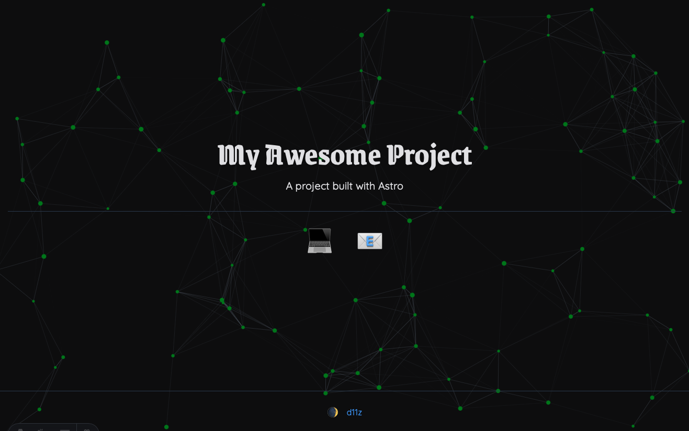

# Satellite Solstice

A simple landing page with a cool animated node background. Uses .env vars for data to allow deploying for multiple sites.



## Usage

It's an Astro project. Download, install, and run dev tools to make changes.

```sh
pnpm install
pnpm run dev
pnpm run build

http://localhost:4321
```

If hosted somewhere like Netlify, pnpm run build can be set to run on deploy automatically on branch update.
